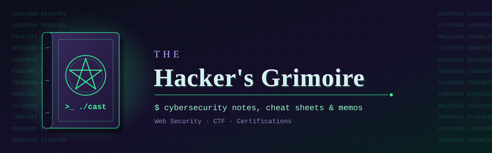

  

# 📖 The Hacker's Grimoire

> My cybersecurity notes, cheat sheets and memos, bound into one book of spells.

Welcome to my grimoire! 🧙‍♂️

This repo is my personal knowledge base. It's where I keep what I learn along the way: notes, summaries, cheat sheets and write-ups from HackTheBox, CTFs, certifications and whatever else I'm studying at the moment.

I made it public in case it helps other people getting into cybersecurity, whether you're a student or just curious.

---

## 📂 What's inside

- **[01 - Web Security](01-Web-Security)**: web vulnerabilities (OWASP Top 10, SQLi, XSS, SSRF), recon, Burp Suite and more.
- **[02 - CTF](02-CTF)**: write-ups from CTFs such as the 404 CTF, plus HTB boxes and events.
- **[03 - Certifications cheat sheets](03-Certs-cheat-sheet)**: quick-reference notes for exams, starting with the eJPT.

New sections will show up as I go.

---

## ⚠️ Disclaimer

Everything here (notes, techniques, scripts) is shared **for educational and research purposes only**.

The whole point is to learn how to defend systems by understanding how they get attacked. **Never try these techniques on systems, networks or applications you don't own, or that you don't have explicit permission to test** (bug bounty scope, pentest agreement, etc.).

I'm not responsible for what you do with this content. Stay ethical! 🤍

---

## 🤝 Contributing

This is first and foremost my own notebook, so it moves at my pace. That said, if you spot a mistake or a typo, or you know a great resource that belongs here, feel free to open an **Issue** or a **Pull Request**. I'd be glad to hear from you.
